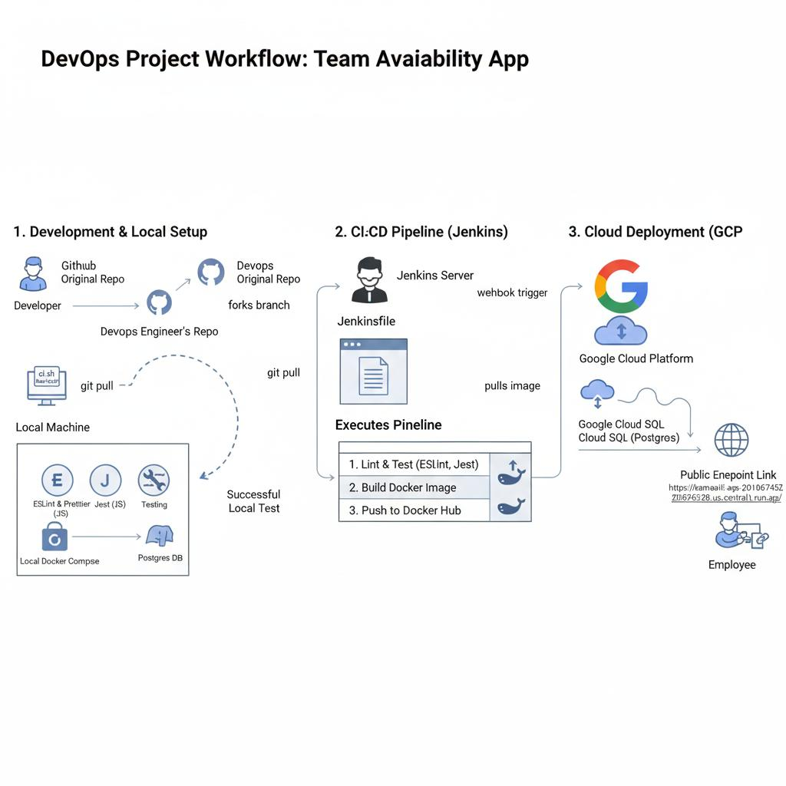

# 🚀 CI/CD Project — Team Availability App

**Hello all!**
Welcome to my **CI/CD project** 👋

This project demonstrates how to build and run a complete **CI/CD pipeline** for a real-world application: the **Team Availability App**.
The goal is to automate the application lifecycle — from code quality checks, to building and containerizing, all the way to running it locally and deploying it on the cloud.

---

## 🔧 What this project covers

* **Code Quality**: Linting & testing automation.
* **Containerization**: Docker & Docker Compose for local environment setup.
* **CI/CD Pipeline**: Automated build and deploy using Jenkins & GitHub integration.
* **Webhook Trigger**: Configured Jenkins to automatically start the pipeline on each GitHub push.
* **Cloud Deployment**: Deployed on **Google Cloud Run** with a managed **Postgres (Cloud SQL)** backend.

---

## 📂 Documentation

For full details, challenges I faced, and how I solved them:
👉 [Read the full Documentation (PDF)](./doc/Documentation.pdf)

---

## 📊 Project Diagram

Below is the high-level architecture & workflow of the project:

---

## 🛠️ Technologies Used

* Git & GitHub
* Bash Scripting
* Docker & Docker Compose
* Jenkins
* Google Cloud (Cloud Run, Cloud SQL)

---

## ✨ About

This project was built during my internship as a way to simulate real-world DevOps workflows.
It reflects my hands-on experience in integrating development, testing, automation, and cloud deployment into one streamlined pipeline.

---

✍️ *Omar Ashraf*
